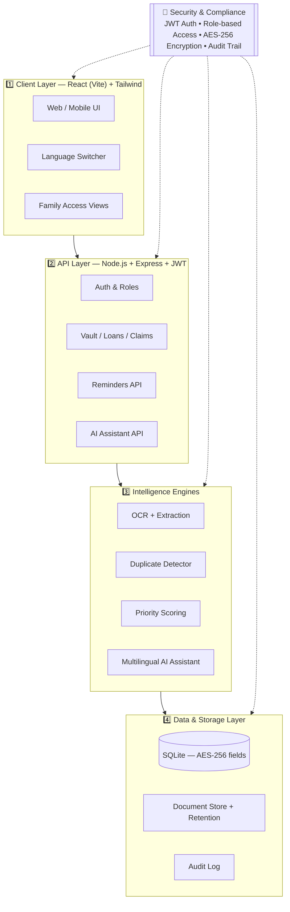

<div align="center">

# 🏦 Digital Estate & Financial Closure Assistant

### *One dashboard for closing and managing a person's financial life after death.*

[](#)
[](#)
[](#-supported-languages)
[](#-license)

**Team Coffe&Code**

</div>

---

## 👥 Team — Coffe&Code

| Name | Role |
|---|---|
| **Sruti Nadar** | Team Member |
| **Nandini Pilane** | Team Member |
| **Nehashree Sivakumar** | Team Member |

> ☕ *Built with a lot of coffee and a little code.*

---

## 📑 Table of Contents

- [📌 Problem Statement](#-problem-statement)
- [💡 Our Solution](#-our-solution)
- [✨ Key Features](#-key-features)
- [🆕 What's New](#-whats-new)
- [🏗️ System Architecture](#️-system-architecture)
- [🔄 Workflow](#-workflow)
- [🧰 Tech Stack](#-tech-stack)
- [🌐 Supported Languages](#-supported-languages)
- [🔒 Security](#-security)
- [🚀 Setup Instructions](#-setup-instructions)
- [📄 License](#-license)

---

## 📌 Problem Statement

> When a person dies, their family may not know what financial assets and responsibilities they had.

Their financial life is often scattered across:

- 🏦 Bank accounts
- 🛡️ Insurance policies
- 💰 EPF / PPF accounts
- 💳 Loans and ongoing EMIs
- 🔁 Subscriptions with automatic payments
- 👤 Nominee details

Today, this information lives in different banks, insurers, and digital platforms — with no single record. The result is a process that is **paperwork-heavy, emotionally exhausting, and easy to get wrong** at the worst possible time.

---

## 💡 Our Solution

A secure, single digital platform that helps a grieving family **organize** the deceased person's financial information and **identify the actions** that still need to be taken — from one dashboard, in their own language.

---

## ✨ Key Features

| Feature | What it does |
|---|---|
| 🏦 **Financial Asset Vault** | Stores bank, insurance, EPF/PPF and investment information in one place |
| 📄 **Document Upload + OCR** | Extracts useful information straight from policies and statements |
| 🔍 **Asset Discovery** | Helps identify potentially forgotten financial assets |
| 💳 **Loan & EMI Tracker** | Shows active loans and recurring payments before penalties add up |
| 🛡️ **Insurance Claim Assistant** | Shows claim-related information and the required next steps |
| 👤 **Nominee Checker** | Identifies missing or outdated nominee information |
| 🔔 **Action Reminders** | Priority-scored reminders for pending financial actions |
| 🤖 **AI Assistant** | Answers questions and gives next-step guidance, in-language |
| 📊 **Financial Dashboard** | Shows assets, liabilities, claims and pending tasks at a glance |
| 👨‍👩‍👧 **Family Access** | Secure, role-based access for authorized family members |
| 🔐 **Secure Access** | Protects sensitive financial documents and information end-to-end |

---

## 🆕 What's New

| Update | Description |
|---|---|
| 🌐 **Multilingual Interface** | Full app translated into **English, Hindi, Marathi, Malayalam, Telugu & Tamil**, with the choice remembered for next time |
| 🤖 **Multilingual AI Assistant** | Ask questions in your own language — the assistant detects and replies in the same language |
| 🧾 **Duplicate Document Detection** | Checksum + OCR-similarity + reference-number matching warns before a duplicate is ever saved |
| 🗓️ **Document Expiry & Secure Deletion** | Active / Expiring Soon / Expired status, expiry reminders, and confirmed, non-silent deletion |
| 🎨 **Calmer, Clearer UI** | Improved hierarchy, spacing, contrast and accessibility — designed for people under emotional stress |

---

## 🏗️ System Architecture

Four layers, wrapped end-to-end by one consistent security and language backbone.



**Highlights**

- 🧠 Explainable priority scoring — every "high priority" flag shows *why*
- 🔒 AES-256 field-level encryption for sensitive vault data
- 🗣️ AI Assistant falls back to an offline, in-language knowledge base — the demo never breaks without internet
- 📜 Every view/edit by every family member is logged in a full audit trail

---

## 🔄 Workflow


---

## 🧰 Tech Stack

| Layer | Technology |
|---|---|
| **Frontend** | React (Vite) + Tailwind CSS + Recharts, full i18n layer for 6 languages |
| **Backend** | Node.js + Express, JWT auth, bcrypt password hashing |
| **Database** | SQLite (relational, AES-256 encrypted sensitive fields) |
| **Documents** | Multer uploads + Tesseract.js OCR + regex/NLP extraction engine |
| **Duplicate Detection** | File checksum + OCR-similarity + document reference-number matching |
| **Intelligence** | Heuristic ML-style scoring for Asset Discovery & Priority Scoring |
| **AI Assistant** | Pluggable Claude / OpenAI integration, with an offline TF-IDF knowledge-base fallback |
| **Notifications** | Scheduled reminders for pending actions & expiring documents |

---

## 🌐 Supported Languages

| Language | Native Script |
|---|---|
| English | English |
| Hindi | हिंदी |
| Marathi | मराठी |
| Malayalam | മലയാളം |
| Telugu | తెలుగు |
| Tamil | தமிழ் |

The selected language applies across the **entire application** — navigation, forms, alerts, dashboards, and the AI Assistant — and is remembered for the user's next visit.

---

## 🔒 Security

- 🔑 JWT-based authentication with role-based access (owner / editor / viewer)
- 🧊 AES-256 encryption for sensitive fields at rest (account numbers, balances)
- 🧑‍🤝‍🧑 Family Access with granular permissions per case
- 🗑️ Explicit, confirmed deletion flows — nothing sensitive is ever auto-deleted silently
- 📜 Full audit log of every access and change

---

## 🚀 Setup Instructions

### ✅ Prerequisites

- [Node.js](https://nodejs.org/) v18 or higher
- npm v9 or higher
- Git

### 1️⃣ Clone the repository

```bash
git clone https://github.com/coffe-and-code/digital-estate-assistant.git
cd digital-estate-assistant
```

### 2️⃣ Backend setup

```bash
cd backend
npm install
```

Create a `.env` file inside `backend/`:

```env
PORT=5000
JWT_SECRET=your-secret-key-here
AES_ENCRYPTION_KEY=your-32-byte-key-here
ANTHROPIC_API_KEY=optional-for-live-ai-assistant
```

Run the backend:

```bash
npm run dev
```

### 3️⃣ Frontend setup

Open a new terminal:

```bash
cd frontend
npm install
npm run dev
```

The app will be available at **http://localhost:5173**, connected to the API at **http://localhost:5000**.

### 4️⃣ Seed demo data (optional, recommended for a live demo)

```bash
cd backend
npm run seed
```

This populates the app with realistic synthetic financial data — no real banking access required.

### 🔑 Environment Variables Reference

| Variable | Required | Description |
|---|---|---|
| `PORT` | ✅ | Backend server port |
| `JWT_SECRET` | ✅ | Secret used to sign auth tokens |
| `AES_ENCRYPTION_KEY` | ✅ | Key used to encrypt sensitive vault fields |
| `ANTHROPIC_API_KEY` | ❌ | Enables live AI responses; falls back to offline mode if unset |

---

## 📄 License

This project is licensed under the **MIT License** — see the `LICENSE` file for details.

---

<div align="center">

Made with ☕ and 💚 by **Team Coffe&Code**
*Sruti Nadar • Nandini Pilane • Nehashree Sivakumar*

</div>
